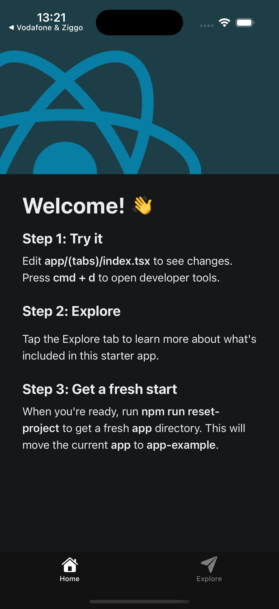

# Exercise 1: Setup a Project

### Objective
Create your Pokedex React Native application using Expo with TypeScript and tab navigation.

### Requirements

#### 1. Create an Expo App
Create a new Expo project using the command line:

> The default template comes with TypeScript, a tab-based navigation structure, and a few helpful example screens to get you started quickly  
> — [Expo Docs: Benefits of using the default template](https://docs.expo.dev/tutorial/create-your-first-app/#benefits-of-using-the-default-template)

### Steps to Complete

1. **Create the project:**
   - Use `npx create-expo-app Pokedex` command

2. **Navigate to your project:**
   - Use `cd Pokedex` command

3. **Start the development server:**
   - Use `npm run start` command

4. **Test your app:**
   - Install the Expo Go app on your phone
   - Scan the QR code that appears in your terminal
   - Or press `i` for iOS simulator or `a` for Android emulator

### What You Should See

After running the commands above, you should see:

1. **A QR code in your terminal** - This allows you to test your app on your phone
2. **Your Pokedex app running** with tab navigation at the bottom
3. **Two default tabs** - "Home" and "Explore"

### Deliverables

To complete this exercise, you must:

1. ✅ Create an Expo project with TypeScript
2. ✅ Use the tabs template for navigation
3. ✅ Successfully run the app on your device or simulator
4. ✅ Show the working tab navigation
