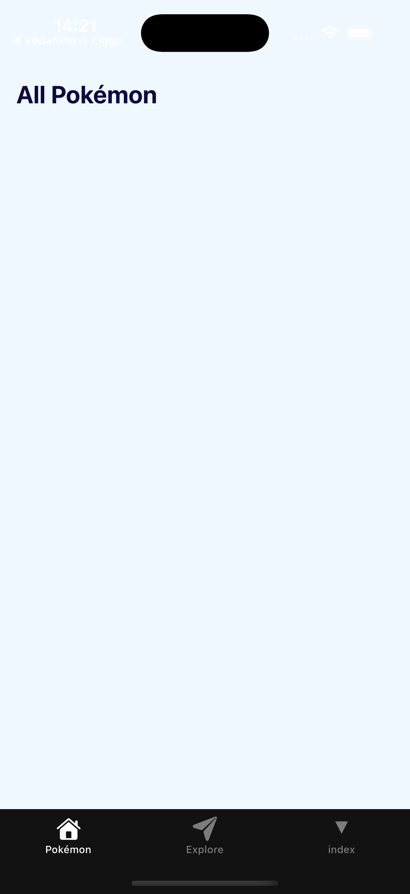

# Exercise 2: Creating a Page and Styling It

### Objective
Learn how to create custom pages and apply styling to make your Pokedex app look professional and Pokémon-themed.

>Figma link: [https://www.figma.com/design/dsgGXcu5WELIvRW90m5308/Pokemon-Code-Challenge](https://www.figma.com/design/dsgGXcu5WELIvRW90m5308/Pokemon-Code-Challenge)

### Requirements

#### 1. Create a New Page
- Create a new screen component for your Pokedex app
- Add it as a new tab in your navigation (e.g., "Pokémon")

#### 2. Style Your Components
- Use StyleSheet to create organized styles
- Apply Pokémon-themed colors and styling

> **📚 Reference:** [React Native StyleSheet Documentation](https://reactnative.dev/docs/stylesheet)

### Steps to Complete

1. **Create a new screen:**
   - Create a new file in the `app/(tabs)` directory
   - Name it `pokemon.tsx`

2. **Add the new tab to your navigation:**
   - Edit `app/_layout.tsx` to include your new screen
   - Add appropriate label
   - Make sure the Pokémon tab is the initial route

3. **Style your components:**
   - Use the Text component to display the title
   - Use `StyleSheet.create()` for organized styling
   - Apply Pokémon-themed colors (background color and the text color)

4. **Use SafeAreaView:**
   - Use SafeAreaView to handle device safe areas (notches, status bars)
   - Install the package: `npx expo install react-native-safe-area-context`
   - Wrap the RootLayout component with SafeAreaProvider
   - Wrap the Pokémon screen with SafeAreaView

> **📚 Reference:** [React Native SafeAreaView Documentation](https://appandflow.github.io/react-native-safe-area-context/)

### Deliverables

1. ✅ Create a new custom screen
2. ✅ Add the screen to tab navigation
3. ✅ Apply styling using StyleSheet
4. ✅ Use SafeAreaView for proper device compatibility
