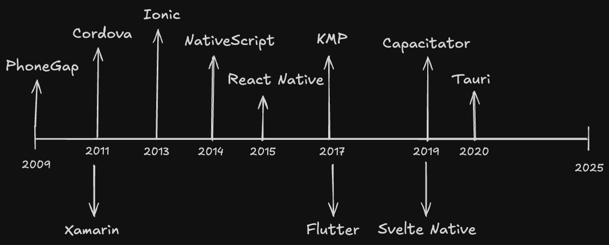
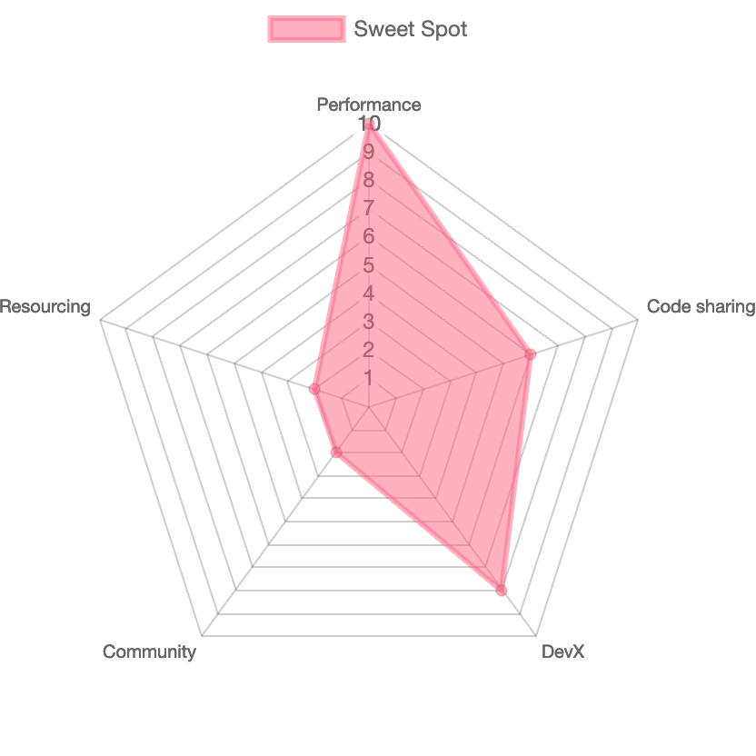
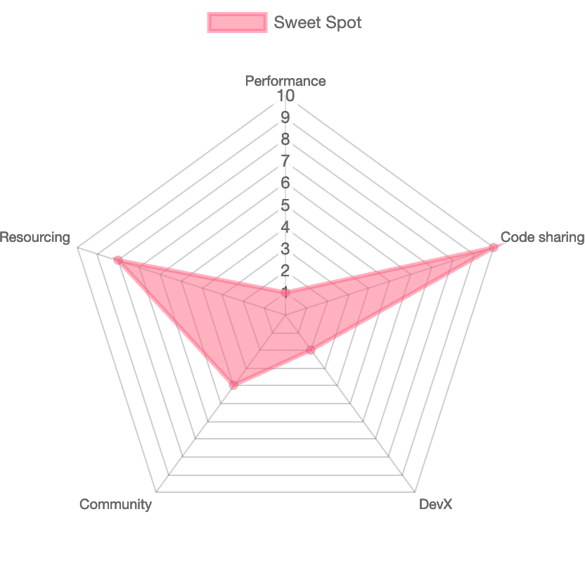
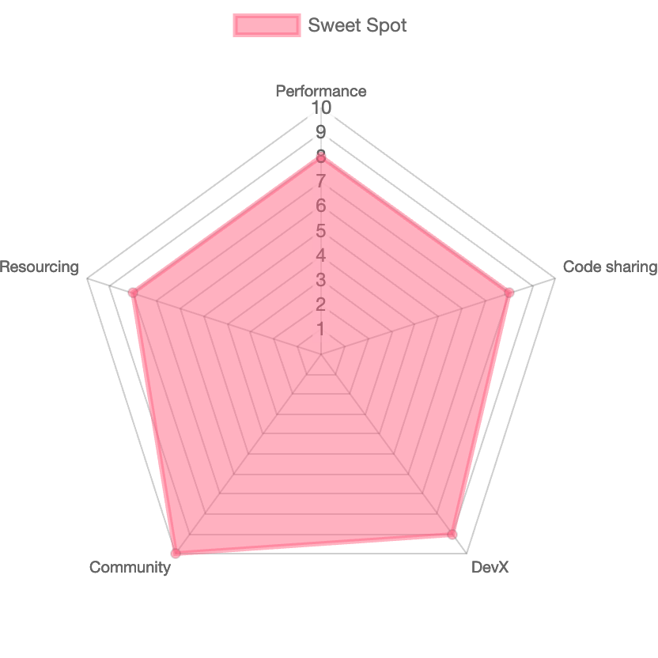
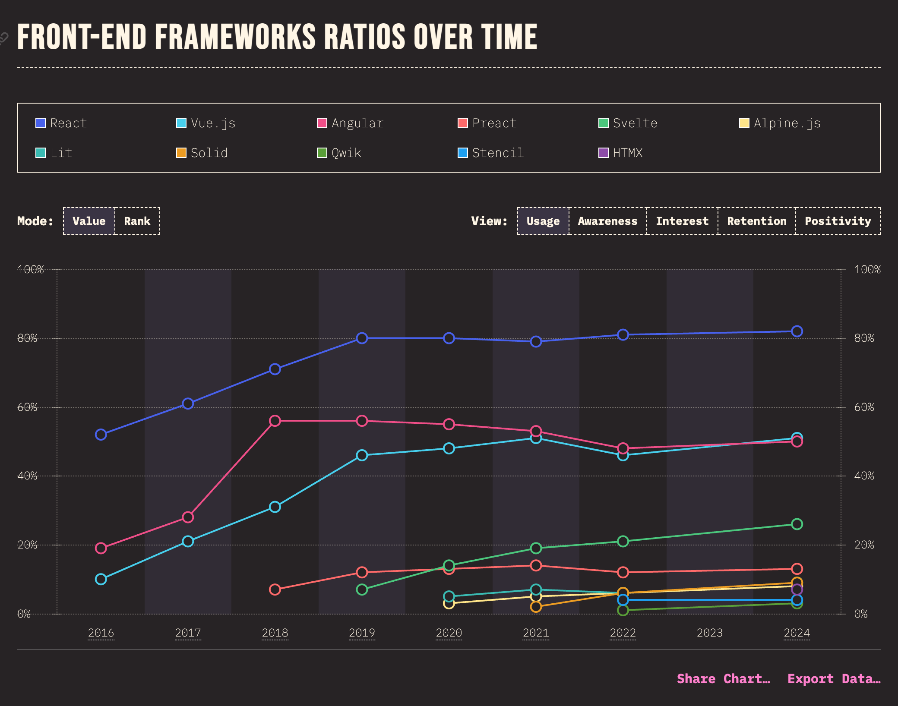
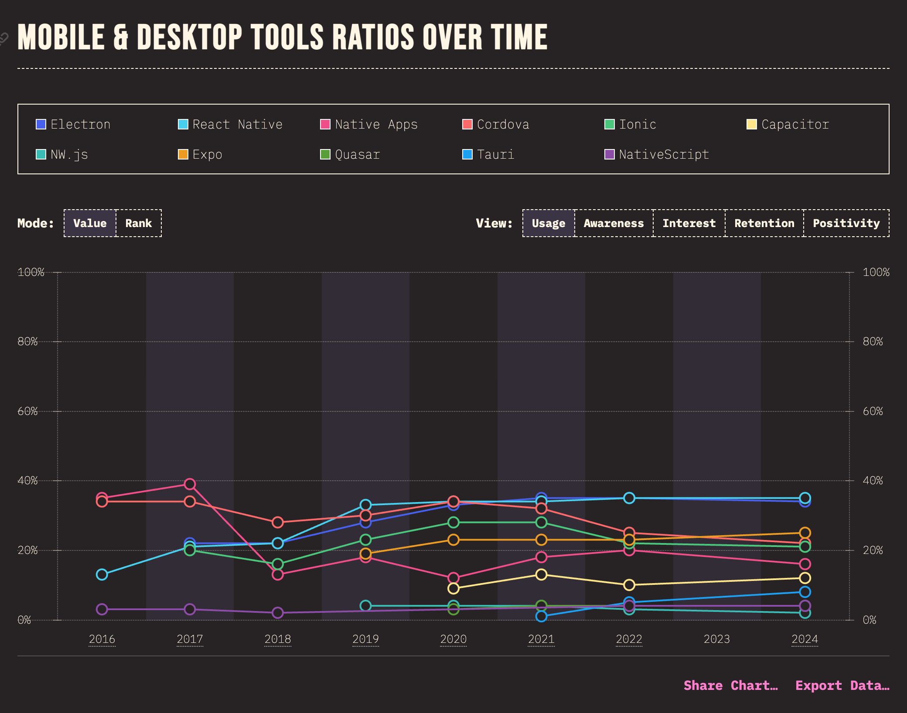
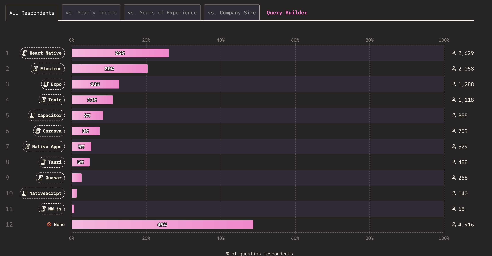
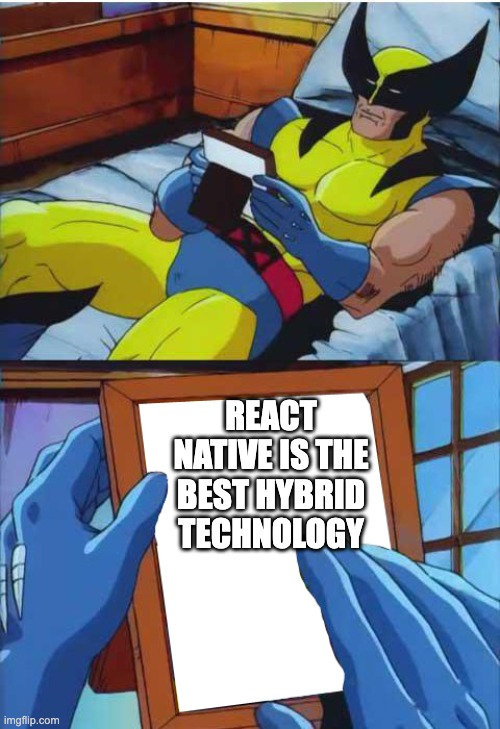

# Brief History of Hybrid Development

"Write once, run anywhere"

---

# Hybrid Techniques over the years

[Timeline](https://app.excalidraw.com/s/7WzUqRCDEgA/2LptH1giHHK)

---

# Performance Evolution

| Approach | Performance Level | Examples |
|----------|------------------|----------|
| **Webview-based** | Lowest | PhoneGap, Cordova, Ionic, Capacitor |
| **Bridge-based** | Improved | NativeScript |
| **Custom Engine** | Near-native | Flutter, React Native |
| **Compiled Native** | Native | Xamarin, KMM |
| **Compiler-optimized** | Excellent | Svelte Native |

---

# Code Sharing Approaches

| Framework Type | Code Sharing | Approach |
|----------------|--------------|----------|
| **Webview** | ~100% | Nearly complete sharing, compromised UX |
| **React Native/NativeScript** | ~70-90% | Shared code with platform-specific adjustments |
| **Flutter** | ~90-95% | Shared code with custom rendering |
| **KMM/Xamarin** | ~50-70% | Shared business logic, platform-specific UI |
| **PWA/Capacitor** | Variable | Web-first with optional native capabilities |

---

# It is all about balance

  

    
    
Xamarin / Flutter

  

  

    
    
PhoneGap / Cordova / Ionic

  

  

    
    
React Native

  

---

---

---

---

---

# Future of Hybrid Development

> "Write ~~once~~ less, run ~~any~~ somewhere"

- Aim for the best platform experience
- Share what makes sense
- One size doesn't fit all
- Line between web and app continues to blur
